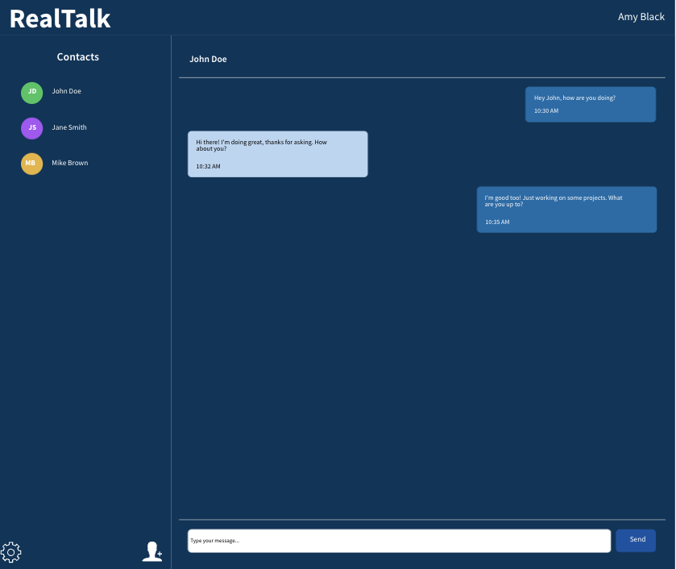

# RealTalk: Instant Messaging with Next.js, Nest.js, and Google Auth

## Product and Focus

**Product:** RealTalk is a real-time messaging platform where users can communicate instantly through an intuitive user interface.

**Focus:** The platform emphasizes seamless user authentication via Google Auth, instant messaging facilitated by WebSockets with Socket.IO, and a modern user experience with Tailwind CSS.

---

## Tech Stack

### Frontend/Backend (Shared)

- **TypeScript:** A typed superset of JavaScript that enhances code quality and maintainability.
- **Socket.IO:** A real-time communication protocol for handling events and messaging.

### Frontend

- **Next.js:** A React-based framework offering server-side rendering (SSR) for optimized performance.
- **Tailwind CSS:** A utility-first CSS framework for designing custom UIs efficiently.
- **Zod:** A TypeScript-first schema declaration and validation library for data validation.
- **SWR:** A data fetching library for handling real-time and cached requests.
- **Radix UI:** Accessible, unstyled components for building user interfaces.

### Backend

- **Nest.js:** A progressive Node.js framework for building scalable server-side applications.
- **Prisma:** An ORM that simplifies database interactions using PostgreSQL.
- **Winston:** A logging library for better application monitoring and debugging.
- **JWT + Auth0:** Secure authentication mechanism with Google Auth for user login.

---

## Frontend Design

### Domain Name Options (Available via NameCheap)

- realtalkapp.xyz
- realtalkapp.me
- realtalkapp.pro
- realtalkapp.online

### Audience and User Flow

**Target Audience:** Individuals seeking simple, secure, and reliable real-time communication with an intuitive UI.

1. **Landing:** Users land on the login page, where they can log in or register using their Google account (Google-provided UI).
2. **Authentication:** Users authenticate with Google Auth and are redirected to the dashboard.
3. **Dashboard:** Users can view their contact list, select a chat, and start messaging. The chat interface displays incoming and outgoing messages, along with real-time updates, typing indicators, and read receipts.
4. **Logout:** Users can log out via a cog/gear icon.

### Sketch of the Dashboard Layout

---

## Frontend Style Guide

### Color Scheme

- **Primary Color:** Navy Blue (#003559)
- **Secondary Color:** Sky Blue (#006DAA)
- **Neutral Color:** Soft Blue (#B9D6F2)
- **Accent Color:** Deep Blue (#0353A4)
- **Dark Accent Color:** Midnight Blue (#061A40)

### Fonts

- **Font Family:** Roboto – a modern and easy-to-read sans-serif font.

### Icons

- **Icon Set:** Material Design icons or React Icons.

---

## Accessibility Features

- **Screen Reader Compatibility:** Designed with ARIA labels and role attributes for better screen reader support.
- **Keyboard Navigation:** All interactive elements are accessible via keyboard shortcuts.

---

## Mobility Features

- **Responsive Design:** The layout is fully responsive for seamless use on mobile, tablet, and desktop screens.
- **Touch-Optimized UI:** Buttons and touch targets are large enough for easy interaction on mobile devices.

---

## Security Measures

- **OAuth 2.0:** Google Auth ensures secure, industry-standard user authentication.
- **HTTPS and SSL:** Deployed over HTTPS, with SSL certificates enforced for all communications, protecting against man-in-the-middle attacks.
- **JWT:** Authentication tokens are signed and verified using JWT for session security.
- **Data Encryption:** Messages and user data stored in the database are encrypted for data protection.

---

## Deployment

- **Frontend:** Deployed on Vercel, optimized for Next.js applications.
- **Backend:** Deployed on Render, a cloud platform simplifying deployment for Nest.js applications.

---

## Contributing

If you wish to contribute to RealTalk, please fork the repository and create a pull request. All contributions are welcome!
